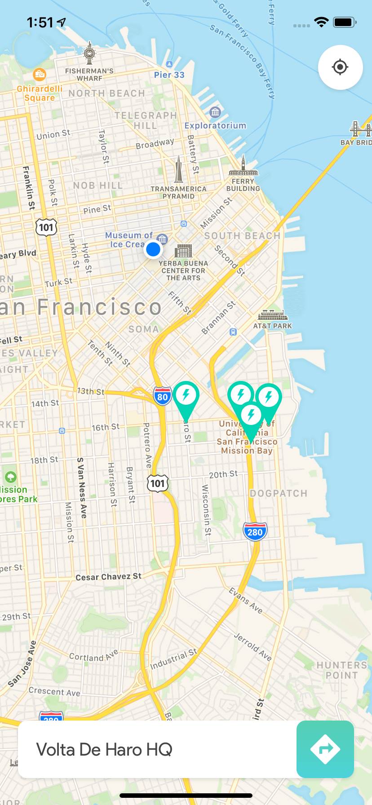
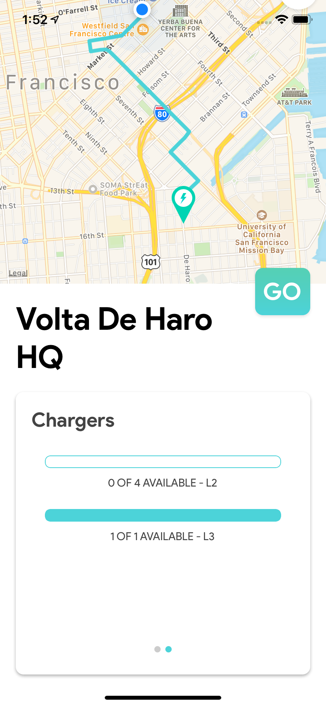

<p align="center">
<a href="https://github.com/bhaveshc789/charge-v/">

</a>
</p>

<p align="center">
<a href="https://github.com/Volta-Charging/data-applications-challenge">Volta Charging Code Challenge</a>
</p>


## What is V-Charge?

Find Volta Charging stations near you.

- Discover stations around the country
- Get more information about multiple stations in a region and real-time availability of chargers.
- Get shortest path from user's current location and navigation options

### Screenshots

<div style={{display: flex; flex-direction: row}}>



</div>

## Getting started
### [Try it on Expo](https://expo.io/@bhaveshc789/charge-v)

```
git clone https://github.com/bhaveshc789/charge-v.git

cd charge-v

npm install

npm start
```

### TODO

- [x] Show station markers on Map Screen
- [x] Implement Card animation for each station
- [x] Navigate to more Information screen in ModalView
- [x] Implement Directions Polyline (shortest path) from user's location to the selected station
- [x] Use site-metrics API to get more information about a particular station
- [x] Show real-time status and availability of chargers
- [x] Progress bar for chargers
- [x] List of multiple chargers
- [x] Implement swiper view for all the information
- [x] Design custom markers
- [x] Get user's current location using button on Map screen
- [x] Navigate from user's current location to the station by setting up a deeplink between native maps
- [x] Polish UI (Custom Font, LinearGradient etc)
- [x] Publish the app and polish README with screenshots/gif of the app

## Demo

## Feedback

In case you have any feedback or questions, feel free to open a new issues on this repo or reach out to me [**@bhaveshc789**](https://github.com/bhaveshc789) on Github.

